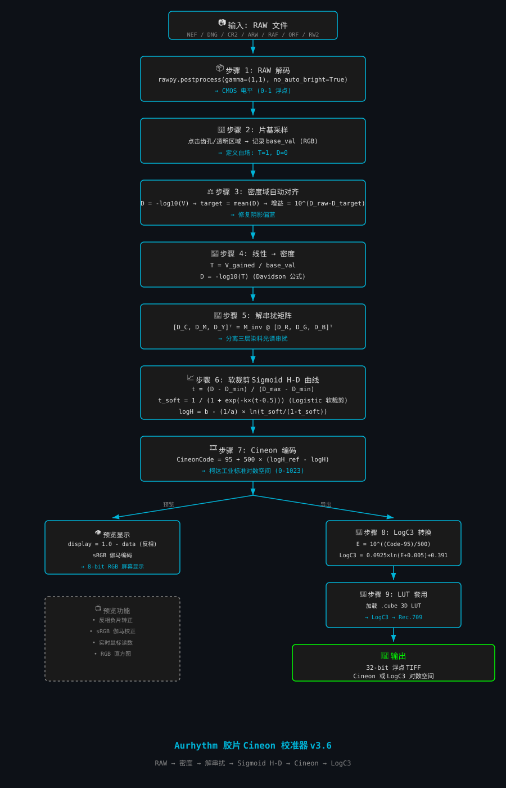

# 🎞️ Aurhythm 胶片 Cineon 校准器 v4.2

> 将彩色负片 RAW 文件科学转换为 Cineon/LogC3 对数空间 TIFF  
> **核心理念**：ICC/DCP色温插值 + 色卡精准矫正 + 密度法 + 解串扰矩阵 + Sigmoid H-D曲线 = 物理映射，而非经验调色

[](https://www.python.org/)
[](LICENSE)
[]()

---

## 📊 算法流程图



---

## ✨ v4.2 新特性

| 功能 | 说明 |
|------|------|
| **ICC/DCP 导入** | 导入相机ICC/DCP配置文件 (.dcp, .icc)，支持日光/钨丝灯双矩阵 |
| **色温插值滑块** | 0=钨丝灯(3200K) → 0.5=中性 → 1=日光(5500K)，平滑插值 |
| **色卡矫正 (并行)** | 导入 .ccmx/.json 或自动检测ColorChecker，与ICC并行工作 |
| **误差分析 (ΔE)** | 色卡校准后自动计算每色块ΔE，评估校准精度 |
| **胶片预设** | 从柯达官方H-D特性曲线采点拟合，默认关闭 |
| **批量处理** | 一键复制所有参数到全部图像，自动片基检测+密度域对齐 |
| **批量导出** | 带进度条，支持选中导出或全部导出 |
| **性能统计** | 每个阶段独立计时，显示总耗时和等效帧率 |

---

## 📐 完整数学公式

### 步骤 1: RAW 解码
RAW (Bayer Pattern) → 线性光 RGB
```python
RGB_linear = rawpy.postprocess(gamma=(1, 1), no_auto_bright=True, output_bps=16)
```
RGB_linear ∈ [0, 1] 浮点数
#### 关闭所有非线性处理（伽马、自动亮度），输出纯线性光信号。

### 步骤 2: ICC/DCP 色温插值
```
M_interp = w · M_day + (1 - w) · M_tung
```
M_day	日光矩阵 (5500K)，从DCP文件读取
M_tung	钨丝灯矩阵 (3200K)，从DCP文件读取
w ∈ [0, 1]	色温权重 (滑块控制)

色温权重对应关系：(w 值)

0	纯钨丝灯 (3200K)
0.5	中性混合
1	纯日光 (5500K)
```
RGB_icc = M_interp · RGB_linear
```
#### DCP标准提供两组矩阵（日光/钨丝灯），通过对光源色温的连续插值，保证任意色温下的色彩响应都是平滑且光谱正确的。

### 步骤 3: 色卡矫正 (最小二乘法)
```
M_cc = (Aᵀ · A + λI)⁻¹ · Aᵀ · B
```
A	检测到的24色块RGB值 (24×3 矩阵)
B	ColorChecker标准值 (24×3 矩阵)
λ = 0.001	正则化参数 (岭回归，防止过拟合)
I	3×3 单位矩阵
```
RGB_corrected = M_cc · RGB_icc
```
误差分析 (ΔE)：
```
ΔE_i = √(Σ(RGB_predicted_i - RGB_target_i)²)   对每个色块 i

ΔE_mean = (1/24) · ΣΔE_i
ΔE_max = max(ΔE_i)
```
#### 3×3矩阵在最小二乘意义下将相机RGB响应映射到标准色彩空间。正则化项 λI 防止矩阵奇异，提高数值稳定性。

### 步骤 4: 片基采样
```
base_val = RGB_sample    (在齿孔或透明区域采样)
```
#### 片基是未曝光的透明区域，代表最大透射率 T=1，最小密度 D=0。

### 步骤 5: 密度域自动对齐
```
D_raw = -log₁₀(V_raw / base_val)

D_target = 0.7    (目标密度，经验值)

ΔD = D_target - D_raw

gain = 10^(ΔD)

V_aligned = V_raw · gain
```
#### 在密度域（对数空间）对齐RGB三通道。密度域对齐比线性域对齐更符合胶片的物理特性，能有效修复阴影偏色。

### 步骤 6: 线性 → 密度转换
```
T = V_aligned / base_val

D = -log₁₀(T)
```
约束条件：
```
T ∈ (0, 1]       透射率
D ∈ [0, +∞)      密度
T = max(T, 1e-6)  防止 log₁₀(0)
```
#### Davidson 公式。密度 D=0 代表完全透明（片基），D值越大代表越不透明（曝光越多）。

### 步骤 7: 解串扰矩阵
```
[D_C, D_M, D_Y]ᵀ = M_inv · [D_R, D_G, D_B]ᵀ
```
示例：
```
M_inv = ┌                      ┐
        │  1.873  -0.398  -0.152 │
        │ -0.221   1.472  -0.108 │
        │ -0.048  -0.241   1.635 │
        └                      ┘
```

矩阵约束：
对角线 > 0	主信号放大
非对角线 < 0	串扰消除
行和 ≈ 1.3-1.5	总增益
M_inv 正定	保证输出非负
#### 彩色负片有三层CMY染料，每层染料会吸收相邻波长的光（串扰）。解串扰矩阵通过线性变换分离三层染料的真实密度。

### 步骤 8: 软裁剪 Sigmoid H-D 曲线
归一化密度：
```
t = (D_CMY - D_min) / (D_max - D_min)

t ∈ [0, 1]
```
Sigmoid 软裁剪：
```
k = 8 / ε    (ε = softness，典型值 0.002-0.005)
x = k · (t - 0.5)

          ┌  1 / (1 + e^(-x))    if x > 0
t_soft =  ┤
          └  e^x / (1 + e^x)     if x ≤ 0
```
logit 逆变换：
```
logit(t_soft) = ln(t_soft / (1 - t_soft))

logH = b - (1/a) · logit(t_soft)
```
D_min	d_min	片基密度 (最亮)
D_max	d_max	最大密度 (最暗)
a	slope	曲线斜率 (反差/伽马)
b	mid	曲线中点 (曝光中点)
ε	softness	肩趾部软度 (ε越小越硬)
#### 胶片的特性曲线（H-D曲线）呈S形。使用Sigmoid函数拟合，将密度域映射到曝光量域。

### 步骤 9: Cineon 编码
```
CineonCode = 95 + 500 · (logH_ref - logH)

logH_ref = 0    (参考曝光量)

CineonCode ∈ [0, 1023]    (10-bit整数)
```
档位换算：
1 档曝光 = log₁₀(2) ≈ 0.301 对数单位
1 档曝光 ≈ 500 × 0.301 ≈ 150 个Cineon编码
#### 柯达Cineon工业标准，将对数曝光量线性映射到10-bit整数编码。

### 🔗 完整数学链
```
┌─────────────────────────────────────────────────────────────────────┐
│                         完整数学链                                  │
├─────────────────────────────────────────────────────────────────────┤
│                                                                     │
│  RAW (Bayer)                                                       │
│       ↓                                                            │
│  RGB_linear = rawpy.decode(RAW)                                    │
│       ↓                                                            │
│  M_interp = w·M_day + (1-w)·M_tung     ← ICC/DCP色温插值          │
│  RGB_icc = M_interp · RGB_linear                                   │
│       ↓                                                            │
│  M_cc = (AᵀA + λI)⁻¹·AᵀB               ← 色卡矫正                 │
│  RGB_corrected = M_cc · RGB_icc                                    │
│       ↓                                                            │
│  base_val = sample_base()                ← 片基采样                │
│       ↓                                                            │
│  gain = 10^(D_target - D_raw)           ← 密度域对齐               │
│  V_aligned = RGB_corrected · gain                                   │
│       ↓                                                            │
│  T = V_aligned / base_val                                          │
│  D = -log₁₀(T)                           ← 密度转换               │
│       ↓                                                            │
│  D_CMY = M_inv · D_RGB                   ← 解串扰矩阵              │
│       ↓                                                            │
│  t = (D_CMY - D_min) / (D_max - D_min)                             │
│  t_soft = σ(k·(t - 0.5))                ← Sigmoid软裁剪            │
│  logH = b - (1/a)·logit(t_soft)                                    │
│       ↓                                                            │
│  Cineon = 95 + 500·(logH_ref - logH)    ← Cineon编码              │
│       ↓                                                            │
│  E = 10^((Cineon - 95)/500)                                        │
│  LogC3 = 0.0925·ln(E+0.005)+0.391      ← LogC3转换                │
│       ↓                                                            │
│  输出: TIFF/EXR/DPX                                                │
│                                                                     │
└─────────────────────────────────────────────────────────────────────┘
```
🚀 快速开始
安装依赖
```bash
pip install rawpy numpy pillow tifffile colorio
```
运行软件
```bash
python Aurhythm.py
```

### 📖 基本操作流程
方式一：使用 ICC/DCP + 色卡矫正 (推荐)
添加 RAW 图像：点击「导入RAW」，选择 NEF/DNG/CR2 等文件

导入 ICC/DCP 配置文件 (可选)

点击「导入 .dcp/.icc」，选择相机配置文件

调整色温滑块: 0=钨丝灯, 1=日光

色卡矫正 (可选)

导入 .ccmx/.json 校准文件

或点击「检测色卡」自动识别 X-Rite ColorChecker

查看 ΔE 误差分析

选择胶片预设

从下拉菜单选择胶片类型 (默认"无")

预设从柯达官方H-D曲线采点拟合

片基采样

点击「采样模式」，在预览图齿孔或片基透明区域点击

或点击「自动检测」

密度域对齐

点击「密度域对齐」修复阴影偏色

预览与导出

调整预览分辨率查看效果

选择导出色彩空间 (Cineon/LogC3)

导出 16/32-bit TIFF/EXR/DPX

方式二：批量处理
导入多张 RAW

配置一张参考图像 (ICC + 色卡 + 片基 + 预设)

点击「批量处理」：自动复制参数到全部图像

点击「批量导出」：带进度条导出全部

📄 许可证
MIT License
