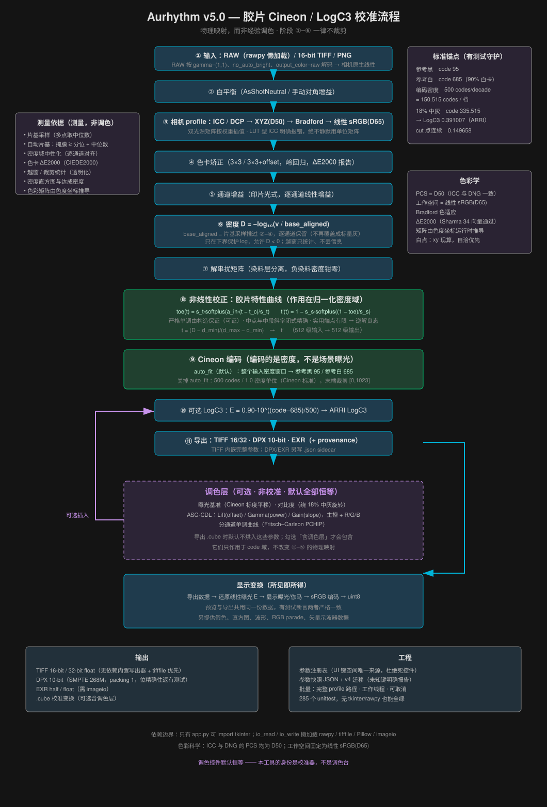

# 🎞️ Aurhythm — 胶片 Cineon 校准器 v5.0

> 把**彩色负片扫描**科学地转换为 **Cineon** 或 **ARRI LogC3** 中间片
> **核心理念**：物理映射，而非经验调色

[](https://www.python.org/)
[](LICENSE)
[]()
[]()



---

## 是什么，不是什么

**是**：胶片校准器。把负片密度**测量**清楚，按 Cineon / LogC3 标准**编码**好，
让下游（Resolve / Nuke / 胶片记录仪）拿到一个物理正确的对数素材。

**不是**：调色工具。所以：

* 默认路径是**纯物理映射**，任何"观感"控件都不参与；
* 调色类控件（ASC-CDL、曝光/对比度、分通道曲线）集中在独立标签页，
  标注「**可选·非校准**」，**默认全部恒等**；
* 导出 `.cube` 时默认只烘**校准变换**，要用调色层必须显式勾选。

**每条结论都有实测数字与回归测试**，包括**承认做不到的地方**（见「已知限制」）。

---

## 快速开始

```bash
# 依赖：核心只有 numpy + Pillow（GUI 用标准库 tkinter）
pip install -r requirements.txt

# 测试（333 个，只需 numpy + Pillow）
python -m unittest discover -s tests -t .

# 图形界面
python Aurhythm.py

# 命令行批量转换
python Aurhythm.py convert --in scans/ --out out/ --format dpx10 --colorspace logc3

# 生成测试素材（确定性，固定 seed）
python Aurhythm.py synth --kind scene --width 1400 --height 950 \
       --out samples/scene_negative.tif --json
```

生成样片是一张**有画面**的合成 C-41 负片（风景 + 场景中的测试卡），含
**橙色罩**、**三层染料串扰**、**逐层反差差异**（γ = 0.59~0.69 D/decade）、
趾/肩、密度域颗粒、未曝光**片基边框**；同时输出 `*_truth.png`（对照正片）、
`*_rawview.png`（扫描仪看到的橙色原貌）与 `*.json`（片种参数 + 配套矩阵）。

> 配套预设「**测试：C-41 合成负片（橙色罩+串扰）**」的矩阵是生成侧矩阵的**精确逆**
> （`Eᵀ·M = I`，误差 3e-16），所以这张图能**一键验证「解串扰」是否真的成立**。

---

## 管线：每一步在做什么，以及为什么

| 阶段 | 做什么 | 为什么这样做 |
|---|---|---|
| ① 白平衡 | as-shot / 手动 / 按片基 | 扫描仪与拍摄光源的色温差 |
| ② 相机 profile | ICC / DCP → XYZ(D50) → Bradford → 线性 sRGB(D65) | 矩阵作用在**线性光**上；DCP 的 PCS 是 D50，必须做色适应 |
| ③ 色卡矫正 | 24 色卡 → 3×3 最小二乘 + CIEDE2000 验收 | 各层**光谱灵敏度**带来的色彩风格在这里收敛 |
| ④ **密度** | `D = −log₁₀(v / base)`，逐通道 | **比值而非减法**：一次减掉罩 + 灰雾 + 片基；①–⑥ 全程**不裁剪** |
| ⑤ 中性化 | 逐通道密度按中位数对齐到目标（默认 0.7） | = 印片光号（printer lights）；自动**排除未曝光片基区** |
| ⑥ **解串扰** | 3×3 矩阵，把通道密度解成三层染料密度 | 橙色罩与染料侧吸收的电子等价物（见下） |
| ⑦ **特性曲线** | 归一化**密度域**上的单调 S 曲线（趾/肩/反差/中点） | Cineon 编码的是**密度**，不是场景曝光 |
| ⑧ 编码 | Cineon（code 95=黑 / 685=90% 白 / 500 codes per decade）或 LogC3 | 与其它 Cineon 工具对齐 |

**曲线为什么必须在密度域**：早期实现把曲线当"密度 → 曝光"用，实测 code 超出 10-bit 量程
**4.5 倍**（最大 2882），完全不可用。改到密度域后，`auto_fit` 把整个输入窗口映射到标准
参考黑/白（95 / 685），输出天然落在可用范围内。

---

## 关键概念（本仓库最值钱的部分）

### 橙色罩 ≠ 灰雾，而且罩不能被"减掉"

| 成分 | 来源 | 颜色 | 随曝光变化 |
|---|---|---|---|
| **橙色罩** | 成色剂（colored coupler） | **强橙**（蓝 ≫ 绿 > 红） | **是**（显影成像时成色剂被消耗） |
| **化学灰雾** | 自发显影 / 老化 / 受热 | 近中性（略偏蓝） | 否 |
| 片基 + 背层 + 明胶 | 支撑体与涂布 | 近中性，很小 | 否 |

`D = −log₁₀(v/base)` 把三者一次减掉（所以 D=0 即完全未曝光）。但**罩本身不是常数** ——
它随曝光变化，这正是「解串扰」必须是**矩阵**、而不能是"减一个灰值"的原因。

同一套机制在传统光化学里也存在，而且**不需要"去除"**：有色成色剂随曝光被消耗，产生一个与
染料不想要吸收**等量反向**的误差，印片时相加为零。中间片链条
（OCN → IP → IN → 发行正片）每一级都带罩、级间互相抵消。数字端之所以必须自己再解一次，
是因为**扫描仪的三个波段 ≠ 正片的三波段**，罩的抵消条件不再成立。

> **实践**：翻拍后若仍看到"灰雾"，先量**片边未曝光区的三通道比例** ——
> 橙的（蓝最高）才是罩；接近中性的灰是别的东西：**化学灰雾、残银、rem-jet 背层残留、
> 或杂散光（flare）**。flare 随画面亮度分布变化，灰雾全局均匀。

### 为什么必须逐通道校准

真实彩色负片的三个感光层，**反差与最大密度都不同**（本项目模型：逐层 γ 相差约 10%）。
一条共享曲线在数学上无法反演逐层差异，残余的逐通道影调差就表现为**偏色**。

实测（合成 C-41 测试图，与真值对照）：

| | 只有共享曲线 | 逐通道校准 |
|---|---|---|
| 中性区色差 Δ(a\*,b\*) | 5–8（偏青，色相角 186°–197°，即"橙↔青"轴的青端） | **0.26** |

**目标函数必须选对**：拿"还原场景的 ΔE 对真值"当目标是**不可能**的 —— 胶片肩部已丢失高光
信息，任何单调函数都反解不回来（实测拟合 RMS 高达 **120 code**）。可解且有意义的目标只有
两条：

1. **中性必须中性**：无彩色阶梯经过片种后，三通道 code 必须一致；
2. **码率符合标准**：每 decade 曝光 500 codes，影调才与其它 Cineon 工具对齐。

`filmsim.derive_per_channel_calibration()` 用「精确解析起点 + 受限拟合」求解，并带
**防退化解**约束 —— 只求"三通道一致"时，优化器会把三个通道**一起压扁**（一起变灰自然就
"一致"了），所以必须同时约束动态范围。

### 预览"发灰"是两件不同的事

1. **编码侧**：Cineon 的 code 95 对应曝光 0.06（sRGB ≈ 0.27），对数数据经 sRGB 显示必然
   被抬起 —— 这是"log 看起来平"的本质，**不是缺陷**。
2. **解码码率**：编码把密度窗口压进 590 个码；显示端若固定按标准 500 codes/decade 去解，
   压进去的密度没有被展开 → 画面被压扁。已知片种 γ 时按
   `REFERENCE_SPAN·γ / 窗口跨度` 自动算码率，并提供「显示」页的**码率倍率**微调。
   **它只影响屏幕，不影响导出。**

要"看起来像照片"，需要一条真正的**观看变换**（view transform，如印片模拟）—— 见路线图。

### 输出：对数直通 vs 经色彩还原 LUT

| | 未套 LUT | 套了「LogC3 → Rec.709」LUT |
|---|---|---|
| 输出域 | 对数（Cineon / LogC3） | **Rec.709 显示域**（含 BT.709 OETF） |
| 用途 | 交给下游调色 | 能直接看的成片 |
| DPX transfer | logarithmic(3) / printing density(1) | **ITU-R 709(6)** |
| DPX colorimetric | user-defined(0) | **ITU-R BT.709(2)** |
| 预览 | 解 log → sRGB | 按显示域显示（不再二次伽马） |

DPX 的 transfer / colorimetric 取值按 SMPTE 268M 的**常见实现**填写，**全部可覆盖**
（UI 高级项 / CLI `--dpx-transfer`），并且**实际写入值会记进导出元数据**，方便在
Resolve 里核对。输出范围支持 `full` / `legal`（10-bit 64..940），同样写入元数据。

---

## 片种预设

C-41 的**染料与成色剂是工艺级常量**，所以所有 C-41 片种共用同一组染料吸收
（同一个解串扰矩阵）；片种之间真正客观的差异是 **γ / D-min / D-max**（反差与宽容度）。
色彩风格来自各层**光谱灵敏度**，不归矩阵管，走色卡 ΔE 那一步。

实测：与真值的最大色差 Δ(a\*,b\*)

| 预设 | 色差 | 预设 | 色差 |
|---|---|---|---|
| Kodak Portra 400 | 0.71 | Kodak Gold 200 | 0.30 |
| Kodak Portra 800 | 0.40 | Fuji C200 | 0.46 |
| Vision3 250D | 1.92 | 通用负片 | 0.67 |
| Vision3 500T | 2.19 | 测试：C-41 合成负片 | 0.26 |
| **不套预设** | **9.85**（预期：未做串扰校正） | | |

> ⚠️ **这些是临时值**（`constants.py` 内有明确标注）：共用 C-41 矩阵 + 按各预设自己的
> 密度窗口推导逐通道值 + 公开典型 γ。
> **待办**：按柯达官方 RGB 吸收曲线反推每只胶片的真实矩阵后整表替换；
> `tests/test_filmsim.py::TestAllPresetsLeaveNeutralNeutral` 会守住不倒退。

---

## 导出

| 格式 | 说明 |
|---|---|
| **DPX 10-bit** | SMPTE 268M；transfer / colorimetric 按输出空间自动，可覆盖，写入元数据 |
| **TIFF 16 / 32-bit** | 内置基线写出器（**无 tifffile 也能用**），元数据 JSON 内嵌 |
| **EXR 16 / 32** | 需要 `imageio` |
| **`.cube` 校准变换** | 3×3 矩阵 + 逐通道曲线；**默认不含调色层**（可勾选包含） |

每张图可另存 `.json` 溯源（全部参数、输出空间、DPX 字段、LUT 路径）。

---

## 测试

```bash
python -m unittest discover -s tests -t .      # 333 passed
```

| 文件 | 覆盖 |
|---|---|
| `test_colorimetry.py` | 色度学（CIEDE2000 对 Sharma 标准向量） |
| `test_constants.py` | Cineon / LogC3 常数、预设物理约束（对角占优等） |
| `test_tonemap.py` | 曲线单调性、精确中点/斜率、**逐通道**、反函数往返 |
| `test_pipeline.py` | 8 阶段、密度域、中性化、串扰、裁剪统计 |
| `test_colorchecker.py` | 24 色卡检测与求解、退化四边形防护 |
| `test_lut.py` | `.cube` 读写、烘焙与管线一致、**调色层不泄漏** |
| `test_output.py` | 输出变换：LUT→目标空间的 DPX 字段/元数据/预览、范围映射 |
| `test_filmsim.py` | C-41 物理正向模型、样片、**全预设中性验收** |
| `test_io_write.py` | DPX/TIFF 位精确往返、溯源 sidecar |
| `test_tooling.py` | 批处理、设置往返、CLI、`synth` |
| `test_regressions.py` | **R1–R15 逐条显式映射**（v4.2 症状 → v5.0 判据），权威清单在这里 |
| `test_app.py` | GUI 结构（真实 tkinter）、参数注册表覆盖、线程模型 |

测试设计的两条原则：

1. **不允许"不会失败的测试"**。曾有一个 ΔE 断言误把 XYZ 当 Lab 喂进 CIEDE2000，
   结果对任何两张图都通过（恒在 0.1 量级）—— 已修正并加了度量自检。
2. **对照测试必须能复现旧错**。例如"窗口上限压到实测值 55% 必须复现 >15% 越窗"，
   否则护栏没有约束力。

---

## 已知限制（如实列出）

* **RAW / 3F 未端到端验证**：本环境没有 `rawpy` / `tifffile` / `imageio`，走的是内置
  TIFF 写出器与 PIL 路径。`.3fr` / `.fff` 已在扩展名表内，但能否解码取决于 libraw 版本，
  需用真文件验证（Hasselblad Flextight 的 `.fff` 与相机的 `.3fr` 是两个不同解码器）。
* **LUT 型 ICC 不支持**（显式报错，不静默降级）；**DCP 的 `ProfileHueSatMap` 未接入**。
* **自动色卡检测是尽力而为**：手动四角是保证可用的路径。
* **片种预设有临时数值**（见上）。
* **大图内存**：全链路目前整幅运算，50–100 MP 素材（如 Flextight 长条扫描）会 OOM。
  需要「解码落盘 memmap + 分块处理 + 分条写出」才能做到与尺寸无关的内存上界。
* **预览不是场景渲染**：需要观看变换才能与"正常照片"一致。

---

## 工程记录（踩过的坑，值得留着）

* **R1–R15 回归**：v4.2 的 15 个缺陷逐条修复并映射到测试。权威清单见
  `tests/test_regressions.py`，包括「512 级输入退化成 3 级」（`MonotoneCurve.is_identity()`
  对 5 点恒等曲线误判 → 1-D 数组塌成 `(3,)`）、双重套用 LUT、LogC3 常数错、
  逐通道片基被标量覆盖等。
* **Tcl 不是线程安全的**：worker 线程调用 `root.after()` 会**间歇性段错误**（exit 139）。
  已重构为 `queue.Queue` + 主线程轮询。
* **胶片 γ 曾经不物理**：`characteristic` 的直线段宽度 = `1/contrast`；早期取
  `contrast ≈ 1.0` → 直线段仅 **3.3 档**、γ 高达 **2.18 D/decade**（真实 8~10 档、
  0.55~0.75）→ 8.5 档的场景一半进饱和区 → 合成负片**必然发灰**（彩度只剩真值 50%）。
* **`sanitize()` 会静默丢掉新增字段**：`linearize` / `density_per_decade` 曾因此失效。
* **导出的 `.cube` 曾经会混入调色层**：烘焙路径若走 `density_to_code`，会把整条 code 域链
  （含 CDL/曲线）套进去，导致"纯校准" LUT 被污染。
* **逐通道的两处不对称**：`code_to_density`（反函数）曾无视逐通道参数；
  `CubeLUT.from_pipeline` 曾用标量窗口烘焙 —— 都会让逐通道预设的往返/导出不一致。

---

## 路线图

- [ ] **片种参数化**：按柯达官方 RGB 吸收曲线反推每只胶片的真实吸收矩阵，替换临时值
      （落点：`_c41_matching_matrix()` 与 `_PER_CHANNEL_BY_PRESET`）
- [ ] **大图流式**：解码落盘 memmap + 分块处理 + 分条写出（目标：RAM 与图像尺寸无关）
- [ ] **观看变换**：印片模拟 / 显示 LUT，让预览与"正常照片"一致
- [ ] **RAW 端到端**：真机验证 `.3fr` / `.fff`，必要时加 dcraw 后备后端
- [ ] 色卡：多光源 / 多张平均、稳健的离群点剔除

---

## 许可

见 [LICENSE](LICENSE)。
